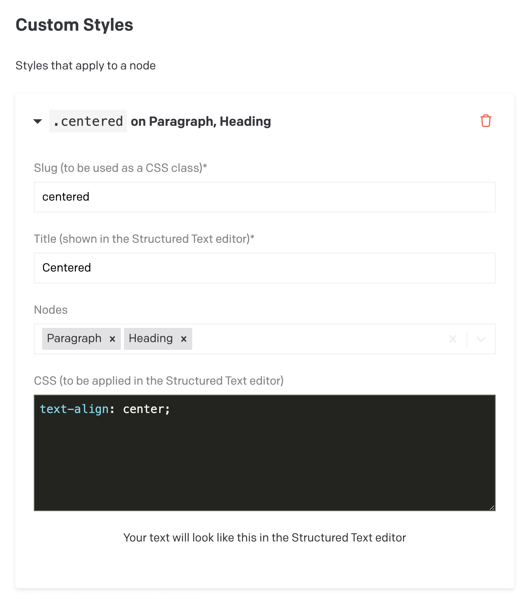

# DatoCMS plugin: Custom text Styles

This DatoCMS plugin makes it possible to add custom styles to the editor of Structured text fields by setting css properties. You can add as many styles as you'd like in the Plugin settings.


## Features

- Add custom styles to editor of Structured Text Fields
- add custom marks (inline styles) to editor of Structured Text Fields
- Add custom CSS class names to rendered nodes in your Structured Text Fields

## Configuration

### Plugin Settings

#### Custom Styles

Add your own Custom Styles. You can set the following attributes:

- `Slug`
  Set this slug to what you want your final css class to be.
  <strong>Please Note: Upon changing this property, you will have to update all Structured Text Fields already used in DatoCMS.</strong>

- `Title`
  This title will be shown in the DatoCMS Structured Text editor.

- `Node`
  For now, you can choose between <i>heading</i> and <i>paragraph</i>

- `CSS`
  This is the CSS shown in the DatoCMS Structured Text editor
  

  #### Custom Marks

  Add your own Custom Marks (inline styles). You can set the following attributes:

- `Slug`
  Set this slug to what you want your final css class to be.
  <strong>Please Note: Upon changing this property, you will have to update all Structured Text Fields already used in DatoCMS.</strong>

- `Title`
  This title will be shown in the DatoCMS Structured Text editor.

- `Icon`
  You can set an icon name based on the icons available from [fontawesome free icons](https://fontawesome.com/search?q=house&o=r&ic=free)

- `Keyboard Shortcut`
  You can set a keyboard shortcut you can use inside the DatoCMS Structured Text editor.

- `CSS`
  This is the CSS shown in the DatoCMS Structured Text editor
  

### Front End Structured Text Implementation

#### Custom Styles

Nodes inside Structured Text will be rendered with a `style` attribute corresponding with the `Slug` set in the Plugin Settings.
(See more info from DatoCMS)[https://www.datocms.com/docs/plugin-sdk/structured-text-customizations#adding-custom-styles-to-nodes]

```JSON
{
    "type": "paragraph",
    "style": "centered",
    "children": [
      {
        "type": "span",
        "value": "This text is centered"
      }
    ]
},
```

Update your front end so that you attribute the `style` property as a CSS class.

```TSX
// example of a possible implementation of a Paragraph Node
---
import type { Paragraph } from 'datocms-structured-text-utils';

interface Props {
  node: Paragraph;
}

const { node } = Astro.props;
---
// Style attribute ('centered') will be accesible from the node
// Paragraphs that have a custom style of 'Centered' will have the css class 'centered'
<p class={node.style}><slot /></p>

```

```HTML
<!-- rendered HTML -->
<p class='centered'> This text is centered</p>
```

You can now proceed to implement your own custom CSS for the `centered` class

```css
p.centered {
  text-align: center;
}
```

#### Custom Marks

Marks inside Structured Text will be rendered with a `mark` attribute corresponding with the `Slug` set in the Plugin Settings.
(See more info from DatoCMS)[https://www.datocms.com/docs/plugin-sdk/structured-text-customizations#adding-custom-marks]

```JSON
 {
      "type": "paragraph",
      "children": [
        {
          "type": "span",
          "value": "This is normal text with"
        },
        {
          "type": "span",
          "marks": ["shout"],
          "value": "only this part"
        },
        {
          "type": "span",
          "value": "having a different mark."
        }
      ]
    }
```

Update your front end so that you attribute the `mark` property as a CSS class.

```TSX
// example of a possible implementation of a Mark
---
import type { DefaultMark, Span } from 'datocms-structured-text-utils';

interface Props {
  node: Span;
}

const { node } = Astro.props;

type Tag = 'span' | 'strong' | 'em' | 'del' | 'mark' | 'code' | 'u';

const elementByMark: Record<string | DefaultMark, Tag> = {
  strong: 'strong',
  code: 'code',
  emphasis: 'em',
  underline: 'u',
  strikethrough: 'del',
  highlight: 'mark',

  // Add custom marks set in custom-text-styles plugin. You can set this to any valid html tag.
  'shout': 'strong',
};

// ensure that all html tags are included
// note the usage of 'node.marks' here, this is were all the applied marks are being stored.
// in our case, this will include 'shout'
const Tags: { Tag: Tag; mark: string }[] =
  node.marks?.map((mark) => {
    const Tag = elementByMark[mark] || 'span';
    return { Tag: Tag, mark };
  }) || [];
---

{
  Tags.reduce(
    (children, { Tag, mark }) => <Tag class={mark}>{children}</Tag>,
    node.value
  )
}
```

```HTML
<!-- rendered HTML -->
 <!-- notice that the tag with the 'shout' class is the same as set in elementByMark -->
<p>This is normal text with <strong class="shout">only this part</strong> having a different mark.</p>
```

```css
strong.shout {
  text-transform: uppercase;
}
```
