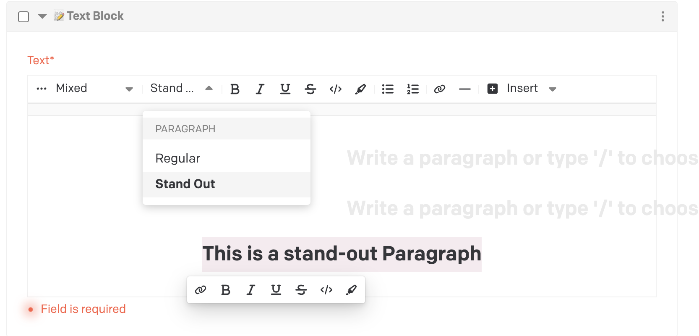
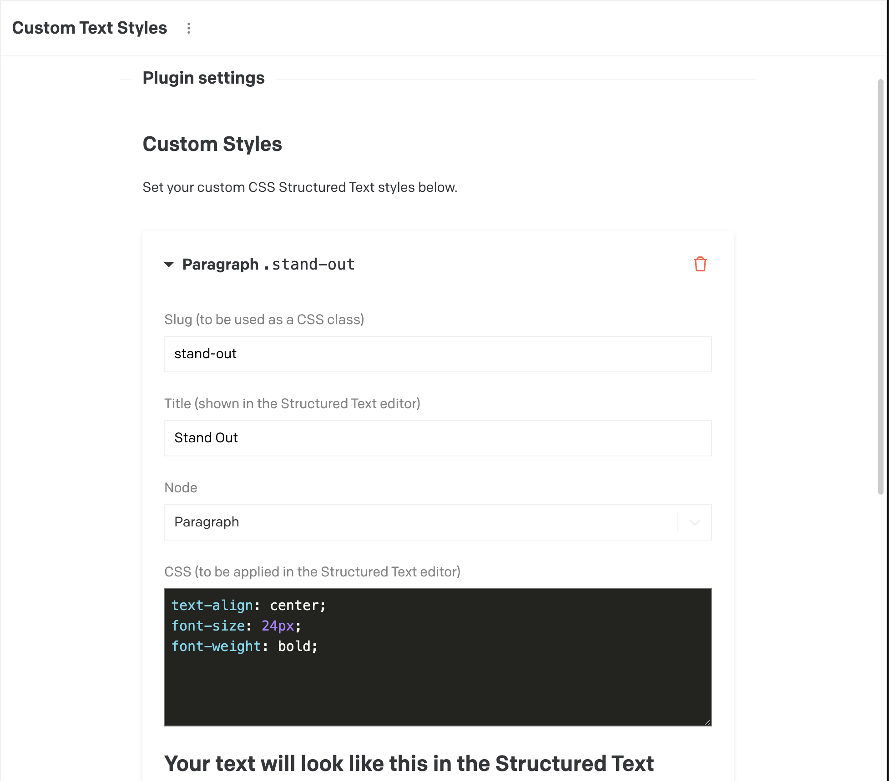

# DatoCMS plugin: Custom text Styles

This DatoCMS plugin makes it possible to add custom styles to the editor of Structured text fields by setting css properties. You can add as many styles as you'd like in the Plugin settings.


## Features

- Add custom styles to editor of Structured Text Fields
- Add custom CSS class names to rendered nodes in your Structured Text Fields

## Configuration
### Plugin Settings
Add your own Custom Styles. You can set the following attributes:
- `Slug`
Set this slug to what you want your final css class to be. 
<strong>Please Note: Upon changing this property, you will have to update all Structured Text Fields already used in DatoCMS.</strong>

- `Title` 
This title will be shown in the DatoCMS Structured Text editor.

- `Node`
For now, you can choose between <i>heading</i> and <i>paragraph</i>

- `CSS`
This is the CSS shown in the DatoCMS Structured Text editor



### Front End Structured Text Implementation
Nodes inside Structured Text will be rendered with a `style` attribute corresponding with the `Slug` set in the Plugin Settings.
(See more info from DatoCMS)[https://www.datocms.com/docs/plugin-sdk/structured-text-customizations#adding-custom-styles-to-nodes]

```JSON
# rendered Node in DatoCMS
{
    "type": "paragraph",
    "style": "stand-out",
    "children": [
      {
        "type": "span",
        "value": "This is a stand out"
      }
    ]
},
```

Update your front end so that you attribute the `style` property as a CSS class.

```Astro
# example of a possible implementation of a Paragraph Node
---
import type { Paragraph } from 'datocms-structured-text-utils';

interface Props {
  node: Paragraph;
}

const { node } = Astro.props;
---
// Style attribute ('shout-out') will be accesible from the node
// Paragraphs that have a custom style of 'Shout Out' will have the css class 'shout-out'
<p class={node.style}><slot /></p>

```

```HTML
# rendered HTML
<p class='shout-out'> This is a Shout Out</p>
```

You can now proceed to implement your own custom CSS for the `shout-out` class
```css
p.shout-out {
  font-size: 24px;
  color: pink;
}
```
